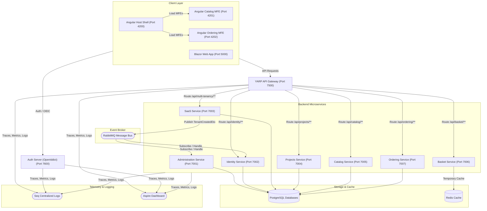

# EcomMicroService

[](https://dotnet.microsoft.com/)
[](https://abp.io/)
[](https://angular.dev/)
[](https://github.com/microsoft/reverse-proxy)
[](https://www.docker.com/)

A modern, enterprise-ready, multi-tenant e-commerce microservices platform built on top of the **ABP Framework** and orchestrated locally with **.NET Aspire**. The system uses a clean **Domain-Driven Design (DDD)** architecture and supports independent development and deployment of both backend microservices and frontend clients (using Angular Micro-Frontends and Blazor WebApp).

---

## 🏗️ System Architecture

The solution represents a decoupled, event-driven, microservice architecture. Requests from client portals flow through a single **YARP API Gateway** to core backend services. Asynchronous communication between services is managed via a **RabbitMQ distributed event bus**, while caching and telemetry keep performance high and operations transparent.



---

## 🌟 Key Features

*   **ABP Framework DDD Architecture:** Each microservice implements strict Domain-Driven Design layout with distinct Domain, Application, Entity Framework Core, and HTTP API (Controller) layers.
*   **.NET Aspire Orchestration:** Standardized container definition, automated startup dependencies (`WaitFor` conditions), health monitoring, and connection injection for infrastructure.
*   **Decoupled Micro-Frontends (MFE):** The Angular client is built on **Webpack Module Federation**, splitting product catalog and checkout logic into remote, lazily-loaded modules managed by a lightweight host shell.
*   **Multi-Tenancy (SaaS):** Native multi-tenancy support using ABP’s SaaS module. Dynamically handles tenant switching, separate databases per tenant, and centralized tenant metadata administration.
*   **Secure Authentication (OIDC/OAuth2):** Supported by a dedicated Auth Server running **OpenIddict** and ABP Account module, providing secure token issuance, single sign-on (SSO), and permission-based authorization checks.
*   **Distributed Event Bus (RabbitMQ):** Enables asynchronous, eventually-consistent communications. For example, creating a tenant fires a `TenantCreatedEto` event to seed tenant admin data dynamically.
*   **High Performance Caching (Redis):** The Basket service relies entirely on Redis caching for sub-millisecond cart read/write capabilities, allowing both anonymous and authenticated shopping sessions.
*   **Centralized Observability:** Fully integrated with OpenTelemetry (Jaeger/Otlp) and Seq centralized logging for tracing cross-service requests, querying audit trails, and checking resource health.

---

## 📁 Solution Structure

The project code is clean and structured into logical directory blocks:

### 📱 `apps/`
The gateway for front-end portals and platform orchestration.
*   **`EcomMicroService.AppHost`** *(Aspire Orchestrator)*: Configures and spins up PostgreSQL, Redis, RabbitMQ, Seq, and all service dependencies.
*   **`EcomMicroService.AuthServer`** *(OIDC Provider)*: Handles login/registration, tenant selection pages, and issues JWT tokens using OpenIddict.
*   **`EcomMicroService.WebApp`** *(Blazor Portal)*: A Blazor WebApp application consuming the API Gateway endpoints.
*   **`angular/`** *(Angular Workspace)*:
    *   `shell`: Host interface serving global navbar, navigation layouts, tenant selections, and routing framework (Port 4200).
    *   `catalog-mfe`: Isolated remote MFE containing product browsing, filter, and detail view pages (Port 4201).
    *   `ordering-mfe`: Isolated remote MFE handling cart layouts, checkouts, and shipping forms (Port 4202).

### 🌐 `gateway/`
*   **`EcomMicroService.Gateway`** *(YARP API Gateway)*: A reverse proxy mapping paths (e.g. `/api/catalog/{*any}`) to backend microservices and injecting global CORS policies.

### ⚙️ `services/`
The core domain services layer. Each directory follows standard ABP structure:
*   **`catalog/`**: REST API and EF Core PostgreSQL mappings for Catalog items (Products, Categories, Brands, Models).
*   **`basket/`**: Basket manager using Redis distributed caching to hold temporary shopping carts.
*   **`ordering/`**: Handles order records, pricing, and checkout states (`Placed`, `Paid`, `Shipped`, `Cancelled`).
*   **`identity/`**: Exposes user roles, claims, and permission checks. Seeds tenant credentials upon tenant creation.
*   **`saas/`**: Manages tenants and connection strings for individual database deployments.
*   **`administration/`**: Holds configuration records, feature flags, dynamically configured permissions, and audit logs.
*   **`projects/`**: A generic task and project management microservice template.

### 📦 `shared/`
Reusable libraries and tools referenced across the services:
*   **`EcomMicroService.DbMigrator`**: Automation utility executing migrations and initial seeding (default credentials, OpenIddict clients, and baseline permissions).
*   **`EcomMicroService.Hosting.Shared`**: Share configurations including Serilog setups, CORS settings, and Aspire dependency initializers (Seq, Redis, RabbitMQ client configurations).
*   **`EcomMicroService.Microservice.Shared`**: Custom authorization filters, JWT authentication configuration, and Swagger overrides.
*   **`EcomMicroService.ServiceDefaults`**: Standardized Aspire defaults for resilience, telemetry/OpenTelemetry, and `/health` and `/alive` endpoints.
*   **`EcomMicroService.Shared`**: Baseline string constants, error codes, and shared DTOs.

---

## 🔌 Resource Coordinates & Ports

When running locally under .NET Aspire, services are mapped to the following coordinates:

| Project / Resource | Type | URL / Port | Description |
| :--- | :--- | :--- | :--- |
| **Aspire Dashboard** | Dashboard | [http://localhost:17027](http://localhost:17027) | Aspire local dashboard containing logs, metrics, and traces |
| **Angular Shell** | Host Frontend | [http://localhost:4200](http://localhost:4200) | Micro-frontend Shell Application |
| **Catalog MFE** | Angular Remote MFE | [http://localhost:4201](http://localhost:4201) | Remote Micro-frontend for Product Catalog |
| **Ordering MFE** | Angular Remote MFE | [http://localhost:4202](http://localhost:4202) | Remote Micro-frontend for Cart & Checkout |
| **Blazor WebApp** | Portal Frontend | [https://localhost:5000](https://localhost:5000) | Blazor-based Portal |
| **YARP API Gateway** | API Gateway | [https://localhost:7500](https://localhost:7500) | Scalar/Swagger documentation page at `/scalar/v1` or `/swagger` |
| **Auth Server** | OIDC Provider | [https://localhost:7600](https://localhost:7600) | OpenIddict token provider, Login, Register, Tenant UI |
| **Administration API** | Microservice | [https://localhost:7001](https://localhost:7001) | Permissions, Features, and dynamic configs |
| **Identity API** | Microservice | [https://localhost:7002](https://localhost:7002) | Users and Role management endpoints |
| **SaaS API** | Microservice | [https://localhost:7003](https://localhost:7003) | Multi-Tenancy control plane |
| **Projects API** | Microservice | [https://localhost:7004](https://localhost:7004) | Template projects service |
| **Catalog API** | Microservice | [https://localhost:7005](https://localhost:7005) | Product listing, Category/Brand API |
| **Basket API** | Microservice | [https://localhost:7006](https://localhost:7006) | Redis-backed Basket management |
| **Ordering API** | Microservice | [https://localhost:7007](https://localhost:7007) | Checkout and order tracking service |
| **PgAdmin** | DB Panel | Admin Panel (Auto-allocated) | Database administration utility running locally |
| **Redis Commander** | Redis Panel | Cache Panel (Auto-allocated) | Redis caching viewer UI |
| **Seq** | Log Server | Log Collector (Auto-allocated) | High-performance log parsing portal |

---

## 🚀 Getting Started

### Prerequisites

*   [.NET SDK 9.0](https://dotnet.microsoft.com/download/dotnet/9.0)
*   [Docker Desktop](https://www.docker.com/products/docker-desktop/) (Required for Aspire containerized resources like Postgres, Redis, RabbitMQ)
*   [Node.js (LTS version)](https://nodejs.org/) & [Angular CLI](https://angular.dev/tools/cli) (For running the Angular frontend)

### 1. Database Setup & Seeding
Before running the system, migrate and seed the database schemas (Administration, SaaS, Identity, Catalog, Basket, Ordering) using the DbMigrator console application.

Open a terminal at the root directory and execute:
```powershell
dotnet run --project shared/EcomMicroService.DbMigrator/EcomMicroService.DbMigrator.csproj
```
*Note: Make sure your Docker daemon is running, as the Migrator will wait for PostgreSQL to boot up.*

### 2. Run the Solution via .NET Aspire
You can launch the backend services and gateways orchestrated in one command:
```powershell
dotnet run --project apps/EcomMicroService.AppHost/EcomMicroService.AppHost.csproj
```
This will launch:
1. Containers for PostgreSQL, Redis, RabbitMQ, and Seq.
2. The DbMigrator to ensure all databases are up-to-date.
3. Every individual microservice API.
4. The Auth Server and YARP Gateway.
5. The Blazor Web App portal.

Once booted, open the **Aspire Dashboard** link displayed in your terminal (usually at `http://localhost:17027`) to view running service logs, trace requests across services, inspect metrics, or locate auto-allocated port bindings.

### 3. Run the Angular Frontend
To run the decoupled Angular Micro-Frontend client:
1. Open a new terminal in `apps/angular`.
2. Install dependencies:
   ```bash
   npm install
   ```
3. Run the application:
   ```bash
   npm start
   ```
The Shell application will launch on [http://localhost:4200](http://localhost:4200) and automatically mount remote MFEs (Catalog from `4201`, Ordering from `4202`).

---

## 🧹 Housekeeping & Maintenance

To clean up compiled binaries, transient files, and `bin`/`obj` folders across all modules, run the helper script in the root directory:
```cmd
clean.bat
```
*(This is particularly useful when upgrading NuGet packages or debugging caching/build issues.)*
